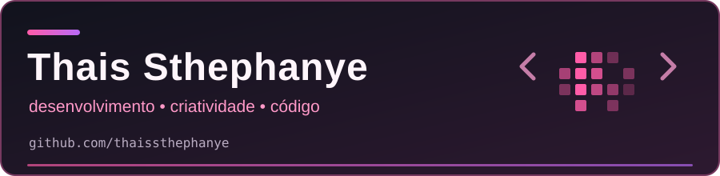

  

<h2 align="center">Oi, eu sou a Thais! 👋</h2>

  Gosto de transformar ideias em interfaces e aplicações. 
  Aqui compartilho meus estudos e projetos de desenvolvimento web, front-end e back-end.

  <a href="https://github.com/thaissthephanye/Portifolio">Portfólio (código)</a> ·
  <a href="https://linkedin.com/in/thais-s-almeida">LinkedIn</a> ·
  <a href="https://instagram.com/sthexzy">Instagram</a> ·
  <a href="https://youtube.com/@thaissthephanye2623">YouTube</a> ·
  <a href="https://discord.gg/strogonoff.js">Discord</a>

---

### 💻 Tecnologias e ferramentas

**Front-end** 

**Back-end e linguagens** 

**Dados e criação** 

---

### 📊 GitHub em números

  
  

  <picture>
    <source media="(prefers-color-scheme: dark)" srcset="https://raw.githubusercontent.com/thaissthephanye/thaissthephanye/output/github-contribution-grid-snake-dark.svg" />
    <source media="(prefers-color-scheme: light)" srcset="https://raw.githubusercontent.com/thaissthephanye/thaissthephanye/output/github-contribution-grid-snake.svg" />
    
  </picture>

